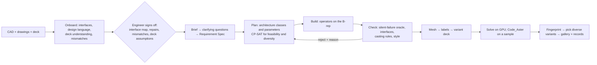

# fastcad v1: plan of record

**Rev B · 2026-09-16 · draft awaiting the user's confirmation.**
- **Rev A:** the decisions from the grilling session (Q1–Q33).
- **Rev B:** adds what the research found (papers, platforms, startups); see [section 16](#16-rev-b-changes-from-research-2026-09-16).
- **Why each decision was taken:** [decisions/decision-rationale.md](decisions/decision-rationale.md).
- **The questions and answers:** [decisions/grilling-decision-log.md](decisions/grilling-decision-log.md).
- **Where we stand against others:** [fastcad-positioning.md](fastcad-positioning.md).

## 1. What fastcad is

fastcad is a standalone, agent-native product. A customer brings three things for a baseline housing: its CAD, its drawings and its FE solver deck. They add a requirement in plain language. fastcad then produces many housing variants that are valid engineering designs. Each variant comes with:

- exact STEP geometry that follows the casting rules and the baseline's design style;
- an equivalent solver deck;
- its solved results.

Later, fastcad replaces fastCAE's variant-generation step through a shared contract (section 3).

fastcad is general. The NREL GRC rear housing (drawing 254492) is the first demo, not the product. The GRC front housing / torque arm (254506) shows it working on another part in the same demo.

### Fixed principles

1. **Generate architectures, not dimension sweeps.** A variant is a choice of which interfaces to connect, with what kind of structure, and how much. Changing one rib height is not a variant in this sense.
2. **The LLM never edits geometry.** Claude Code writes and tests operators during development, and they are exposed as tools. At runtime the agent chooses operators and calls them; it writes no code.
3. **Every variant is an exact B-rep STEP**, with its interfaces preserved and named. There are no mesh-only variants.
4. **Realism comes from casting-rule checks plus the design style measured from the baseline.** The untouched baseline must pass every check.
5. **The runtime agent asks about choices that depend on the requirement.** Examples: may existing ribs change, is this a rework or a new casting, is there a new torque. None of this is hard-coded.
6. **The agent never invents loads, material values or limits.** These come from the baseline deck, from inputs the engineer has signed off, or from a documented derivation method.
7. **Local first.** Everything runs on the laptop (RTX 5060 8 GB, 16 GB RAM), with cloud only when needed. The LLM sees derived data (graphs, specs, metrics, renders), never raw customer STEP. The model provider can be swapped.
8. **Names carry meaning, and we keep them** (added 2026-09-16). CAE engineers already label their decks: bearing bores, mountings, bolts, holes, PIDs, node and element sets. Those names are an input we assume exists, and they are the platform's best source of context about what each region *is*. So:
   - the deck's names are read as they are, carried through every variant, and shown to the agent and the user unchanged;
   - fastcad's own decks use the same conversational names, never positional codes;
   - a deck whose names are codes is a weak input, and the sign-off is where an engineer supplies the real ones, once.
9. **Inputs are engineering artifacts, and gaps are asked, never assumed** (added 2026-09-16 at the user's instruction). The platform reads only **drawings, CAD and solver decks**, and every file it reads is visible in `assets/`. Anything else is either **derived by our code** or **asked of the engineer at sign-off**, where they label it. A value from a report or prior analysis may be *proposed* at sign-off with its source shown, and never used silently. Before a large campaign, the system lists the gaps that must be filled first. Facts are never hardcoded to make a step appear to work.

## 2. Inputs

| Input | For the demo | Notes |
|---|---|---|
| Baseline CAD | `assets/target/254492_prep_small_adv.step`: the production housing with its ribs, closed by the user in Onshape and re-exported with "remove small entities". **This is the canvas**, named in `assets/fastcad.toml`. The first export and the HealAndSew one sit beside it for the record. |
| Drawings | 254492 rev J, 4 sheets | A rework drawing. Note 1: "MATERIAL: EXISTING HOUSING 251342 (Rev E)". |
| Baseline solver deck | Code_Aster deck for the production housing (section 7.1) | Material, supports, couplings, loads and outputs all come from here. |
| Assembly context | Gear and bearing tables and drawings from `cae-data` (GB3) | Keep-out envelopes are derived from these tables (Q14). Neighbouring parts are exported to STEP only if the tables prove too limiting. |
| Requirement | A plain-language brief | Turned into a typed Requirement Spec, with clarifying questions where needed. |
| Part for the generality test | 254506 front housing: STEP plus drawing | Needs converting and closing in Onshape. Its deck is drafted by analogy with the rear housing's (Q27). |
| Moved-interface answer key | GB2 housing 251342 rev E: STEP plus drawing | Used for the GB2 → GB3 rework test (Q24). |

**`assets/` layout.** Built on 2026-09-16, and deliberately small: 9 files, so what a run reads is visible at a glance.

```
assets/
  fastcad.toml          names the canvas
  target/cad/           the part being edited
  target/drawing/       its drawing
  target/deck/          the solver deck: mesh and setup
```

Everything else the project holds — earlier CAD exports, 286 drawings of neighbouring parts, 8 NREL reports, the rib-free housing, and the YAML notes written during the research — sits in `reference/`, which no run reads. When a run needs one, it is copied into `target/` and becomes visible in the Input Console.

### What the artifacts don't say, and how it gets filled

Per principle 8, each of these is either derived by the code or asked at sign-off. For the GRC housing:

Reviewed with the user on 2026-09-16, and the list is shorter than it first looked. **The deck is the truth for the physics, and the CAD for the geometry.**

| Question | Answer |
|---|---|
| Which bearing sits in which seat? | **Not needed for variants.** The deck couples each seat and applies its load; the operator only needs the cylinder to be frozen. It matters only when a campaign changes that bore, and then the requirement states the new bearing. |
| Ratings and load cases? | **Not needed.** The deck defines the load case. A different case means a different deck, which is an input change. |
| The mounting scheme? | **Not needed.** The deck's supports and couplings are the setup: held bolt holes, coupling reference nodes, seat groups, all with their own names. |
| The carrier-share assumption? | **Not needed.** The deck is the truth, and we start from the load case as it stands. Changing it means changing the deck. |
| The material grade? | **Not needed.** The deck gives E, ν and ρ. A grade would matter only for an absolute stress limit, and that limit comes from the brief. |
| Test measurements and NREL's cautions? | **Not needed now.** Background for fastCAE later, not an input to generating variants. |
| Gear data? | **Not needed for frozen-interface variants.** It is needed to re-derive loads when a bearing moves (Q30), and the gear drawings hold it, so that becomes a drawing-extraction job when we get there. |

**What genuinely still has to come from outside the artifacts:**

| What | How it gets filled |
|---|---|
| The brief's targets and limits: mass target, tilt limit, stress limit | **The Requirement Spec**, through the runtime agent's questions. This is the requirement itself. |
| A foundry rule sheet | **Optional.** Without one, the rules calibrated from the baseline apply (Q21). |
| Keep-out for features added inside the cavity | The CAD holds only the housing. The conservative rule, "do not intrude past where metal already is", is **measured from the CAD**. Only a campaign that wants to go further needs an answer from the engineer. |
| Conversational names, where the deck has none | The deck's names are the source (principle 8). The stand-in deck we inherited uses positional codes (`BORE_AX1_S4`, `BORE_MAIN_S2`), which tell the agent nothing. **The production deck built in M0 step 4 replaces them with names an engineer would use** — `hss_rear_bearing_seat`, `carrier_adaptor_seat`, `ring_flange_bolt_07` — proposed by the system and confirmed once at sign-off. From then on those are the only names: they appear in the UI, in the decks, in the agent's reasoning and in the results, and everyone speaks them. The old codes are not part of the platform's vocabulary; where the M0 validation needs to line results up against the earlier reference solve, that correspondence is a note in the validation record, not a feature. |

**The original proposal** (kept for the record):
- `target/`: STEP, drawing, baseline deck.
- `context/`: GB3 neighbourhood drawings, GB2 parent drawings, NREL reports.
- `tech-data/`: `grc_techdata.yaml` and `interfaces.yaml`, where every value carries its source and page.
- `generality/`: 254506.
- `validation/`: 251342.
- `MANIFEST.csv` and `PROVENANCE.md`: DOE/NREL attribution under CC BY 4.0. The quarantined `*54530*` files and the OEDI-738 data are excluded.

We do not extract drawing tolerances unless a downstream goal needs them (Q33).

## 3. Output: the variant record (the contract shared with fastCAE)

Each variant produces:

- **STEP (AP242)**, plus a **separate JSON face map** that names every interface and group. No CAD platform exports face names inside STEP (Onshape's AP242 keeps only geometry, MBD data and face colours), so fastcad owns face identity.
- **Design graph**: features as nodes. Each node holds the feature's type, its placement in its parent's local frame, its sizes and an on/off flag. Edges mean "supported by". Because placements are relative to the parent, features follow when an interface moves.
- **Recipe**: the operators called, their parameters, the Requirement Spec, and the software and model versions (provenance).
- **Check report**: validity, silent-failure check, interfaces, casting rules and style. Every rejection carries a reason.
- **Solver deck**: `.comm`, `.med` and `.export`, replicating the baseline exactly (section 7), plus the results (`.rmed` and a signals table).
- **Fingerprint**: deck outputs plus geometry descriptors (section 7.4).

The same schema is also defined for:

- the tool interface (engineering MCP);
- the design-space database, which stores the records.

## 4. How it works



**People sign off at four points:**
1. the interface map and canvas-repair report, once per part;
2. every mismatch between CAD and drawing (the user decides each one);
3. the baseline deck's assumptions;
4. the Requirement Spec, before a campaign runs.

## 5. What varies

### 5.1 Structural variants, with interfaces frozen

Features are added onto the production housing. The system recognises the existing ribs and webs and keeps clear of them. Where there is no room, it adds nothing.

The rear housing has **no mounts of its own**. The gearbox is supported at three points: the main bearing, plus two torque arms on the front housing. Every rear-housing load leaves through the ring-gear flange (25 M24 studs preloaded to 256 kN, plus 8 dowels). So the "bore-to-mount" classes become "bore-to-flange" here.

| # | Class | On 254492 |
|---|---|---|
| 1 | Baseline | Production housing as it is |
| 2 | Bearing collar | Full or partial collars on the seat exteriors (Ø541, Ø360, the IMS and HSS bosses) |
| 3 | Collar + radial ribs | 2–6 ribs, graded, symmetric or biased toward the loaded side |
| 4 | Collar + curved supports | Ribs that follow the wall |
| 5 | Inter-bearing bridge | Main–IMS and IMS–HSS: straight, deep, double or upper/lower |
| 6 | X- or K-braced bridge | Between the bore regions |
| 7 | Bore-to-flange triangular path | From a seat to the ring-gear flange |
| 8 | Shared trunk to flange | Two seats feed one trunk into the flange |
| 9 | Front–rear tie rails | Rails linking the front (z ≈ 114–170) and rear (z ≈ 426–680) bearing walls. These control shaft slope, which drives lead misalignment. |
| 10 | Circumferential reinforcement | Belts at the flange or pilot, and a ring on the carrier-support web at Ø541, where GB3's design model showed high strain |
| 11 | Windowed structural web | A web with rounded windows and a minimum ligament |
| 12 | Hybrid | Combinations of the above |

Dimensions vary continuously within each class: thickness, height, depth, window size, blend radius. Symmetric versus load-biased layouts are an option in every class. Equal-mass campaigns compare classes at the same mass.

### 5.2 Moved interfaces: all four kinds are in v1 (Q11)

**Interfaces stay frozen within a campaign.** A campaign may ask for a new bore diameter or location, a moved mount, or a larger envelope. The four kinds:

1. **New diameter on the same axis.** Re-cut the bore. If the wall left around it is too thin, grow a collar.
2. **Shift within the boss or wall.** Fill the old bore, remove the old boss, grow a new boss, cut the new bore, and re-attach the ribs connected to it.
3. **Shift beyond the wall.** Morph that region of the B-rep, then re-cut the exact bores.
4. **Envelope growth**, for example a larger ring gear. The layout grows but the details keep their size (Q25).
   - The B-rep is morphed.
   - Things that don't scale are restored: the exact interfaces, wall thickness class, fillets, and bolt size, spacing and count.
   - Standard modules (bosses, flanges, bolt patterns, cover seats) are rebuilt as fresh parametric features rather than morphed.

**These always come with:**
- **Rework check.** Does the change fit inside the existing casting's material (so it can be machined), or does it need a new pattern?
- **Round-trip test.** Move an interface, move it back, and the result must reproduce the baseline within 0.2 mm.
- **Re-derived loads.** A tool reproduces the baseline's gear-statics method for the new positions or torque (Q30). The engineer confirms the method once, and the loads are labelled "derived".
- **Answer key.** Starting from the GB2 housing plus GB3's changes, regenerate GB3 and compare it with the real 254492. Those changes were: pilot Ø1164 → Ø1166, bore Ø540 → Ø541, flange holes 23 → 25, and new ports.

Demo scenarios (the numbers are examples):
- HSS rear bearing 32222 → 32224;
- IMS–HSS centre distance 285 → 295 mm;
- HSS centre distance +15%;
- ring gear +10%;
- the GB2 → GB3 rework.

### 5.3 Existing features

Everything is supported:
- add only;
- unlock named existing features to thicken, extend, thin or remove them;
- replace a whole existing rib network.

Which one applies is a runtime question for the customer (Q12). The rib-free `housing_baseline.brep` is the answer key for testing the rib recogniser on GB3.

### 5.4 Not in v1

- Printed-sand mould rules.
- Aluminium die casting or fabricated housings.
- Tolerance realizations as geometry (Q33).
- Extra probe load cases and modal analysis (Q32).
- Shafts or a whole gearbox.
- The loop of gear contact analysis (LTCA) and microgeometry, which belongs to fastCAE.

## 6. Checks

- **Silent-failure oracle, on every operation:**
  - the result is a valid solid;
  - its volume changed by the amount expected;
  - nothing changed outside the edited region;
  - the mesh is consistent inside and out.

  This matters because the production STEP contains a known silent-failure trap (section 15).
- **Interfaces:** frozen faces are identical before and after, and so are bearing shoulders and counterbores. The GRC lesson here: an error in one counterbore left a tapered bearing unretained.
- **Casting rules that are always hard (Q21):**
  - minimum wall thickness;
  - hot-spot modulus versus feeding;
  - junction rules: no X-junctions (split them into two offset Ts), and no boss on a rib node;
  - section changes no steeper than 1:5;
  - draft of at least 1.5° on every new face, in its region's pull direction.

  Faces with no draft in the baseline are left as they are.
- **Style, measured from the baseline:**
  - walls 15 mm nominal;
  - internal webs 20 mm, front radial ribs 25 mm, external ribs 15 mm;
  - fillets mostly R10, then R25;
  - pull along Z, parting at z ≈ 65–70;
  - exterior surfaces draft toward +Z (side walls 3.39°, bottom walls 8.1°, external ribs 2.4°), interior surfaces toward −Z.
- **Handbook values fill the gaps:** ribs about 0.8 × wall thickness, fillet radii Ri = (s1+s2)/2, ISO 8062-3 machining stock.
- **Values from GRC's own drawings:**
  - draft 1.5°, cast fillets R6 and edge radii R2 (end cover 251338, ductile iron 65-45-12);
  - unspecified radii R3.0;
  - bores B and EV may be machined back by at most 1.00 mm.
- **Customer rules win:** if the customer brings a foundry rule sheet, it replaces these defaults.

## 7. Physics: replicating the deck

### 7.1 The baseline deck

**The existing deck** is `fastcae/assets/GRC_Gearbox_Housing/baseline.*`:
- Code_Aster 18, TET10 elements.
- 25 flange bolt holes, each rigidly tied to a reference point that is held in translation.
- 6 bearing seats, each with an RBE3 coupling to a loaded reference node.
- One linear static case, DLC 1.3 extreme at 401 kN·m.
- Material: E = 169 GPa, ν = 0.275, ρ = 7.2e-9 t/mm³.
- **It is meshed on the rib-free housing.** On the production housing it gives meaningless results: 22 mm of displacement and 2,703 MPa.

**The production housing has already been solved with the same setup**, in fastcae's meshing gate study, meshed from the CAD surface:
- largest displacement 0.418 mm, p99.9 von Mises 55.1 MPa;
- seat tilts from 0.40′ to 1.84′;
- gear-mesh lead −0.123 mrad on the IMS and −0.385 mrad on the HSS.

That study's files sit in an old Temp scratchpad, so they are preserved first thing in M0.

**The production baseline deck is built in M0:**
1. Re-mesh the production housing with **fTetWild**, which keeps edges, corners, holes and ribs. CGAL tends to smooth these.
2. Convert to TET10 and apply the same seat and bolt labels, couplings, loads and material.
3. Solve with both Code_Aster and the GPU solver, and compare with the gate study.
4. You sign off the deck's assumptions:
   - which bearing sits in which seat (two are disputed between sources);
   - the 50% carrier-share assumption on the Ø541 seat (the plausible range is 460–920 kN).

Whether to use fTetWild for every variant is decided later, for fastCAE. Until then, fastcad v1 meshes variants the same way as the baseline, so comparisons are like for like.

### 7.2 Variant decks

**The deck is replicated exactly for now; improvements come later** as a signed-off revision applied to the baseline and every variant alike (Q31).

- **Copied unchanged:** material, element types, support and coupling options, load values, analysis settings and outputs.
- **Regenerated for each variant:** mesh, the 65 groups, and the reference points. For moved interfaces, the reference points are recomputed and the loads re-derived.

### 7.3 Solving

fastcad solves every variant (Q28):

- **fastcae's GPU solver**, ported: 23 s for about 1.1 M unknowns, agreeing with Code_Aster to 1e-11. The graphics card limits a model to about 2.4 M unknowns.
- **Code_Aster**, run on a sample (for example every 20th variant plus all finalists), to certify that the written decks run in the customer's solver.

### 7.4 Fingerprint and diversity

**The fingerprint:**
- deck outputs: the motion of each of the 6 seat reference nodes in all six directions, the seat tilts, and the IMS and HSS gear-mesh lead misalignment;
- stress percentiles and mass;
- geometry descriptors from the design graph.

**Diversity:**
- CP-SAT forces a minimum architectural difference between selected designs.
- Differences below the measured mesh noise don't count. That noise is about 7% on the smallest seat tilt and 18% on element stresses.

## 8. The agent

- **Runtime:** LangGraph, whose tools are served by an **engineering MCP server**. If LangGraph can't do the job, switch to the Claude Agent SDK (Q17).
- **Default models:** **start with DeepSeek v4-pro through OpenRouter**, as agenticCAE does, and move to Claude later (the user's decision, 2026-09-16). The provider stays swappable in config, so the switch costs nothing.
- **Tools** (all deterministic, all written and tested during development):
  - inspect, extract interfaces, read drawing callouts, cross-check CAD against drawing, measure design language;
  - understand deck, prepare canvas;
  - plan campaign (CP-SAT);
  - structural operators: collar, radial ribs, connect, bridge, tie rail, flange path, belt, window, pad, modify existing;
  - interface operators: re-bore, move bore, morph region, grow envelope;
  - rework check;
  - validate, mesh, write deck, solve, fingerprint;
  - select diverse, compare, export.
- **Clarifying questions** the runtime agent asks, and then records in the Requirement Spec:
  - which interfaces are frozen and which change;
  - whether existing features may be modified, and which;
  - rework or new casting;
  - new gear or bearing data, or a new torque;
  - foundry rules or the baseline-calibrated defaults;
  - objectives and limits: mass, tilt or misalignment, stress;
  - campaign type (design brief, dataset, or equal-mass) and size;
  - how to resolve each CAD/drawing mismatch;
  - deck assumptions. For a new part, its supports and loads.

## 9. Geometry kernel: a bake-off in M0 ("whoever gets the job done")

**Three candidate backends** (rev B):
1. **OpenCascade (OCCT), local and free.** Driven through build123d, with SimpleCADAPI (Apache-2.0) as the layer for selectors and stable IDs, and FreeCAD's repair and defeaturing tools as a clean-up pass beforehand.
2. **Parasolid through Onshape, in the cloud.**
   - One pre-written FeatureScript "operator interpreter" feature carries out a JSON list of operations using `opFillet`, `opBoolean`, `opMoveFace`, `opOffsetFace`, `opDeleteFace` and `opModifyFillet`.
   - About 3–4 API calls per variant; FeatureScript that runs inside Onshape doesn't count against the allowance.
   - Allowances are per user, per year: 2,500 calls on Standard, 5,000 on Professional, 10,000 on Enterprise. Apps publicly listed in the App Store are exempt.
   - Regeneration stops after 10 minutes.
   - Data stays on AWS; there is no on-premises option.
3. **CGM (Spatial), CATIA's kernel, local and commercial, on an evaluation licence.**
   - It offers defeaturing, feature recognition on imported models, direct editing and deformation, and repair of imported geometry.
   - Its APIs are C++ and C# only, so it needs a wrapper.
   - Using it depends on Spatial granting an evaluation.

**Not in the bake-off:**
- **SolidWorks:** the same Parasolid kernel as Onshape, plus Windows COM automation, licence risk, and FeatureWorks is weak on castings.
- **NX, or a Parasolid SDK licence:** kept only as the answer if customers reject cloud CAD.
- **Autodesk, CATIA and Houdini:** skipped.

**One operator layer for every backend:**
- Operations are declarative and pick faces by semantic selectors (such as `bore:B2`), never by face index.
- Each backend has an adapter with a table saying which operations it supports natively, which it emulates, and which it can't do.
- fastcad keeps the face map itself, updated from each backend's history and re-matched by geometric signature.
- Every output is re-imported into OCCT and checked there, whichever backend made it.
- If an operation fails on the primary backend, it is retried on the secondary one.

**OCCT's documented limits that hit our part** (the reason for the bake-off):
- Its fillet algorithm can't handle a contour that ends where 4 or more edges meet, or a fillet that runs past its limiting face. That is exactly a rib root crossing an existing blend.
- Defeaturing needs the neighbouring faces not to be tangent.
- There is no operation to move a face and heal around it.

**The test suite** runs about 30 operations on the repaired production canvas:
- a rib with a root fillet on a flat wall;
- a rib whose root crosses an R25 blend (this failed 0/9 times in OpenCascade so far);
- a collar around a seat;
- a window cut;
- a re-bore 15 mm larger;
- a 10 mm bore shift;
- removing a boss;
- a 2 mm wall offset;
- a region morph;
- rebuilding the flange and bolt pattern.

**The winner** is the candidate with the most operations passing the silent-failure oracle; speed breaks ties. If the winner needs a paid plan, you decide at the end of M0.

**What we already know:**
- OpenCascade handles local additive edits well: 16/16 fuses and 4/4 simple fillets succeeded.
- It fails silently on some fillets and on cuts through the whole body, near a defective face (section 15).
- gmsh cannot mesh this STEP directly. The CAD-surface route works: triangulation, then CGAL with the seat edge lines.

## 10. Code

The fresh repository lives at `C:\Work\fastcad` (git, Python 3.12, uv). Modules are ported with their tests (Q18).

**From fastcae:**
- face-ID-preserving extraction and the drawing-callout parser plus cross-check;
- the deck reader (`aster.parse_comm`/`interpret`) and MED I/O;
- label transfer (`carry`), redone to follow semantic interfaces rather than baseline face IDs;
- the GPU TET10 solver (cuDSS);
- the deck writer (`campaign._run_aster`, `bench/solvers/baseline_deck.py`);
- the compiled CGAL mesher and size maps;
- CP-SAT patterns;
- Parquet/Zarr records.

**From agenticCAE:**
- the OpenCascade boolean pipeline;
- the LangGraph console patterns (a human approval step, Postgres checkpoints, LangSmith);
- the React viewer, chat and campaign components;
- `loads.json` (gear statics) and `gearbox.json`.

**Also:**
- The Sept-11 rib plan (SDF blending and a voxel check) is replaced by this plan.
- fastcae's signed-distance field is used only for fast checks: wall thickness, hot spots, clearance.

## 11. Demo

**Audience:** OEM housing and CAE engineers first, with a shorter cut of the same demo for investors. There is no date, so we plan by milestones and cut nothing.

**Script:**
1. **Onboarding.** Drop in the STEP, drawing and deck. The agent shows the interface map, the design language, what the deck does, the CAD/drawing mismatches (each one decided by the user) and the canvas-repair report.
2. **Deck transfer.** The same simulation, re-established on the real housing. This gives the baseline row of the results table.
3. **The brief:** "Lighten by 8%, keep all interfaces, no worse IMS/HSS misalignment, sand-cast."
   - The agent asks its clarifying questions and writes the Spec.
   - It produces about 10 architecture variants, each with a table: mass, seat tilts, gear-mesh leads, stress, and pass/fail on every check.
   - It shows an equal-mass view ranking bore motion per kg.
4. **"Generate 100 more"**: a gallery that fills as variants stream in, plus a diversity view.
5. **Moved interfaces:** the five scenarios, the rework check, and the GB2 → GB3 answer-key score.
6. **Generality:** the front housing onboarded, with its own variants and a deck drafted by analogy. The agent asks for the loads.
7. **Handover:** STEP files, decks and records exported for fastCAE.

**Success bar:**
- After sign-off, the interface map matches every bore and datum on the drawing.
- At least 10 of the 12 classes are built on 254492.
- At least 90% of emitted variants pass every check, and every rejection has a reason.
- "Generate 100 more" completes geometry and checks in 30 minutes or less on the laptop, with fingerprints streaming in.
- The equal-mass view works.
- The blind panel has run: you plus 2–3 engineers.
- All five moved-interface scenarios and the round-trip test pass.
- The front housing works end to end.

## 12. Milestones

| | Scope | Done when |
|---|---|---|
| **M0: foundations** | See the list below the table. | Signed-off map, style and deck for 254492. Kernel chosen. Timings measured. |
| **M1: structural core** | Collar, radial ribs, connect and pad operators; the casting and style checks; variant decks; GPU solving; the results table; a CLI. | 50 variants across at least 4 classes, at least 90% passing, and the baseline row matches M0. |
| **M2: agent and 12 classes** | LangGraph plus MCP; the Spec with clarifying questions; CP-SAT planning and diversity; the remaining classes; windows; modifying unlocked features; equal-mass campaigns; "Generate 100 more"; the web app. | A plain-language brief yields 100 variants across at least 10 classes, and the performance bar is met. |
| **M3: moved interfaces** | Re-bore, move bore, morph, envelope growth; the rework check; the round-trip test; gear-statics loads; re-anchored decks; the GB2 → GB3 test. | All 5 scenarios pass, round-trips stay within 0.2 mm, and GB3 is regenerated and scored. |
| **M4: generality** | 254506: onboarding, its style, variants including bore-to-mount paths, and a deck by analogy with loads asked from the engineer. | At least 50 front-housing variants pass the checks. |
| **M5: demo** | Blind panel, rehearsed script, investor cut, performance tuning, the dataset contract to fastCAE. | The full success bar. |

M0 covers, in this order (revised 2026-09-16):
1. Preserving the gate study and this session's analysis outputs.
2. Creating the repo and building `assets/`.
3. **The production deck**, meshed with fTetWild, using **the load vectors already in fastcae's `loads.json`**. Nothing is re-derived. It is solved and compared with the gate study. The user signs off two things: which bearing sits in which seat, and the carrier-share fraction.
4. **The Input Console** (added by the user, 2026-09-16). A UI that makes visible exactly what goes into a run:
   - `assets/` is the only folder the user fills, and the UI lists every file in it, marking the ones the product needs as selected;
   - after import, the user sees the drawings, the CAD, the mesh and the solver setup that the variant work will use;
   - one button solves the baseline in Code_Aster, cached afterwards;
   - ported from fastcae's Input and Reproduce tabs where that is cheaper than writing fresh.
5. **The kernel bake-off, run on the current STEP as it is.** Parasolid and CGM heal imported geometry when they read it, so how much repair we need depends on which kernel wins.
6. **Repair, scoped to what the winning kernel still fails on**, plus the silent-failure check.
   - The tighter Onshape re-export was done on 2026-09-16. `prep_small_adv` cut self-intersecting pieces from 24 to 1 and slivers from 23 to 6, and lowered the worst edge tolerance from 0.43 to 0.27 mm, at the cost of 425 more faces. `prep_auto` changed nothing at all.
   - Whether `prep_small_adv` becomes the canvas is decided by the operation tests (the blend-crossing fillet, and the whole-body cut), not by the defect counts.
7. Extracting the interfaces and design language, with drawing cross-checks and the user's decisions on mismatches.
8. Measuring meshing and solving time per variant.

## 13. Your action items

1. **Optional: re-export 254492** from Onshape at a tighter tolerance, as a cheap test of whether the loose edge tolerances disappear. The user's existing closed solid stays the canvas either way (revised 2026-09-16).
2. **Onshape: convert and close 254506** (the front housing) to STEP.
3. **Get the GB2 housing** `251342-1.SLDPRT` from your D: copy or by re-downloading it. Then convert and close it in Onshape.
4. **Optional:** Onshape API keys, so Parasolid can join the bake-off and conversions can be scripted.
5. **Sign-offs in M0:**
   - the interface maps and canvas-repair report;
   - each CAD/drawing mismatch;
   - the deck's assumptions: seat identities and carrier share.
6. **Name 2–3 engineers** for the blind panel (M5).
7. **Request a Spatial evaluation for CGM and 3D InterOp** (rev B). It needs the company's details, and the licence terms for a startup need checking.
8. **Get Onshape API access on a paid plan for the bake-off** (a few hundred calls). Also check whether fastcad qualifies for the Onshape startup programme, which excludes "service providers" (rev B).

## 14. Deferred decisions and defaults to confirm

**Deferred, and when they get decided:**
- fTetWild for every variant: later, in fastCAE.
- Deck improvements (Q31 B): after M3.
- Extra probe load cases and modal analysis: when needed.
- Tolerance metadata: only if a downstream goal needs it.
- Printed-sand rules: later.
- A paid kernel plan: end of M0, if Parasolid wins.
- Shafts or a whole gearbox: after v1.
- Reading and writing other solvers' decks (Abaqus `.inp`, Nastran `.bdf`, Ansys `.cdb`, SimScale setups): after v1 (rev B).
- Nonlinear deck features (contact, bolt preload): through the signed-off deck revision (Q31 option B).
- Craig–Bampton reduced-model export and the compliance probe load cases: when fastCAE needs them.
- Go-to-market (rev B), to decide after the demo:
  - an Onshape App Store listing;
  - pairing fastcad variants with SimScale physics for customers who have no solver deck;
  - selling design-space datasets to Neural Concept, PhysicsX and SimScale;
  - offering fastcad operators as Synera nodes;
  - joining the Association Industrial AI expert group.

**Defaults, now confirmed by the user (2026-09-16):**
- DeepSeek first as the default model, moving to Claude later.
- Code_Aster as the solver.
- Plan rev B accepted, to be adjusted as work progresses.
- Code_Aster certifies a sample of decks rather than every deck.
- Variants are meshed the same way as the baseline.
- `C:\Work\fastcad` becomes a git repository.

## 15. Key facts and sources

- **Part:** 254492 rev J, "REAR HOUSING REWORK".
  - 921.15 kg per the drawing, which implies 7.2 g/cm³.
  - STEP: 2,167 faces (as OpenCascade reads it), 1190 × 1305 × 688 mm, 127.9 dm³.
  - The frame: main axis Z through (0,0), flange face at z = 0.
- **Interfaces:**

  | Axis | Features |
  |---|---|
  | Main | Pilot Ø1166 (B). Ø541 (EV): the carrier adaptor, holding the PLC-B and LSS-A bearings. Ø360.029 (EW): LSS-B/C. |
  | HSS at (0, 520) | Ø180 (EY), Ø200 (EX), Ø211 counterbore |
  | IMS at (246.30, 376.61) | Ø180, Ø272 |

  - Centre distances: 450.00 mm (main–IMS) and 285.00 mm (IMS–HSS).
  - Ring-gear flange: 25 × Ø26 holes, 5 × M24 and 8 blind holes on a 1120 mm pitch circle, plus the datum-C dowel.
  - Source: STEP analysis cross-checked against the drawing.
- **Mismatches between CAD and drawing** (for you to decide):
  - the datum-C dowel is mis-modelled;
  - 7 of the 25 flange holes are Ø26.5 in the CAD but Ø26 on the drawing;
  - the M5 holes are missing from the CAD;
  - the upper rear counterbore differs from section A-A.
- **Defects in the canvas:**
  - 24 self-interfering sub-shapes and 469 edges with tolerance above 0.1 mm;
  - face 1904, the 10° cone around the HSS rear boss, makes global cuts silently lose up to 25% of the volume.
- **Gears:**

  | Stage | Teeth | Normal module | Helix | Other |
  |---|---|---|---|---|
  | Planetary | sun 21, planet 39, ring 99 | 10 | 7.5° | planets at r = 308.0 mm |
  | IMS | 82 / 23 | 8.25 | 14° | |
  | HSS | 88 / 22 | 5 | 14° | |

  Overall ratio 81.491. Source: NREL TP-47773 and the GB2 test plan.
- **Ratings:** 750 kW. NREL's 100% test torque is 360 kN·m, and the test limit is 400 kN·m.
- **Market gap (from the research):** nobody publicly generates foundry-valid variants of large castings with casting rules as hard constraints. Almost nobody reports results in gear-engineer terms: bore compliance, misalignment, KHβ. Learned CAD generators handle at most about 100 faces, so the operator-based route is the only one that works at 2,000 faces.
- **Where the details are:** this session's scratchpad (`step-analysis\`, `deck-analysis\`, `cae-extract\`), plus fastcae's `docs/research/field-meshing-gate.md` and `docs/research/baseline-deck.md`.

## 16. Rev B changes from research (2026-09-16)

These come from the reviews of papers, platforms and startups, and await the user's confirmation along with the rest of the plan. Each links to its source.

**Operators and tools**
- **Operators split into a family and a resolver.** The LLM names an operator family and the interface IDs; deterministic resolvers compute every coordinate. *(Embodied CAD)*
- **Face selection:** selectors with count checks, typed shape handles, and tool descriptions generated from the code. *(CADIR, CADDesigner)*
- **Errors report cause, location and suggested fix.** *(CADDesigner, CADSmith)*
- **Each operator declares the `verify` conditions it should satisfy afterwards**, and the oracle checks them. *(ArtisanCAD)*
- **When a fallback changes a radius**, the variant is tagged "degraded", not counted as a clean pass. *(startups research, analysis of nTop's claim)*

**Face identity**
- **Geometric signature matching** is the core identity layer, with anchor points as a fallback. It serves:
  - the check that nothing changed outside the edited region;
  - the frozen-interface checks;
  - carrying deck labels onto each variant (with area, centroid and normal compared against the baseline);
  - the round-trip test;
  - replay into other CAD systems.

  *(CADIR, COSMO)*

**Spec and planner**
- **Typed requirement rows**: id, type, metric, operator, limit, load case, derivation. Before any solve, each is checked to confirm it points at a real result. *(FEA-feedback)*
- **An accept-or-ask clarifier**: it asks all its questions in one batch and leans toward asking. Conflicts found by CP-SAT, and clashes with frozen interfaces, become questions for the user. *(ProCAD)*
- **Failures are routed by cause.** An operator failure retries with new parameters; a plan failure becomes a CP-SAT exclusion. *(ArtiCAD)*
- **A default escalation order:** thicken or fillet → rib or web → change the architecture → move an interface or grow the envelope. *(AgentsCAD)*
- **A library of signed-off recipes** seeds CP-SAT and new parts.
- **The agent stops refining once the spec is met.** *(CADDesigner, COSMO)*
- **Onboarding output is kept as a reusable "part skill"**: the interface map, style parameters with their ranges, and the checks. *(ArtisanCAD)*

**Onboarding**
- **CAD-to-drawing matching is tiered by confidence** and measured (precision and recall). Exact matches are accepted automatically; near-ties and mismatches are ranked and shown to the user, who decides (Q23). *(Design-to-Plan)*
- **For review, the STEP is shown as views with dimensions added automatically**, and renders give each interface its own colour and ID label. *(IterCAD, AADvark)*
- **VLMs read what the drawing says; deterministic code reads its geometry.** *(VLM-CAD)*

**Validation and evidence**
- **Cheap checks run first, stopping at the first failure:**
  - exactly one connected solid;
  - no voids;
  - every new feature fused to the part;
  - no dangling edges;
  - a watertight surface.

  *(Zero-to-CAD, CADSmith, CAD-MLLM)*
- **The agent can read solver and checker outputs but never write them.** Every number on a variant card cites the logged call that produced it. *(Physics-in-the-Loop, COSMO, Agents' Last Exam)*
- **The oracle itself is measured:** how many deliberately planted faults it catches, and how many bad variants slip past it in an audited random sample. *(startups research)*

**Diversity**
- **The fingerprint adds:**
  - a multi-view image embedding, with coverage and near-duplicate rate;
  - an efficiency ratio (stiffness per kg);
  - a sensitivity report after each campaign, showing which parameters drive stiffness and mass.

  *(Zero-to-CAD, Physics-in-the-Loop, VLM-CAD)*

**Evaluation and the demo claim**
- **The demo scenarios become benchmark tasks** in the Agents' Last Exam format: hidden references, a hard gate followed by a score, and a check that every number traces to a source. These tasks are:
  - the 8% lightening brief;
  - the 5 moved-interface cases;
  - the round-trip test;
  - GB2 → GB3;
  - the front housing.
- **A general-agent baseline** runs the same tasks: Claude Code or Codex using build123d.
- **Metrics that count failures:** full versus partial passes, and first-try versus repaired.
- **Robustness tests:** perturbed briefs with simulated users, tightened thresholds, and held-out architecture classes. *(Agents' Last Exam, IterCAD, FEA-feedback, ProCAD, COSMO)*
- **We publish a yield funnel with explicit denominators**, instead of citing nTop's anecdotal 70–80%:
  - plans proposed → feasible → built → degraded → rule-compliant → interfaces intact → meshed and solved → unattended from start to finish;
  - compared with a naive baseline;
  - plus determinism, and GPU-hours per valid variant.

  *(startups research)*

**Robustness and learning**
- **Before touching the gearbox, operators and the oracle are stress-tested** on Zero-to-CAD's Apache-2.0 STEP corpus, and on regression tests built from controlled degradations. *(Zero-to-CAD, IterCAD)*
- **Every (state, call, check result) step is logged**, so a small local planner can be trained later. *(Embodied CAD, COSMO)*

**Kernel (section 9)**
- **The bake-off has three lanes:** OCCT (with SimpleCADAPI and the FreeCAD clean-up pass), Parasolid via Onshape, and CGM.
- **The operator layer works the same on every kernel**, with a separate face map.
- **Onshape is preferred over SolidWorks.**

**Physics**
- **fastcad copies the customer's own high-end solver setup, never CAD-embedded FEM.** SimScale's structural analyses run on Code_Aster, the same solver as our deck. Reading other solvers' decks is deferred until after v1.
