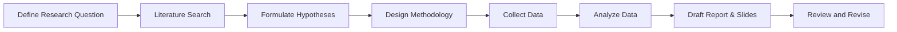
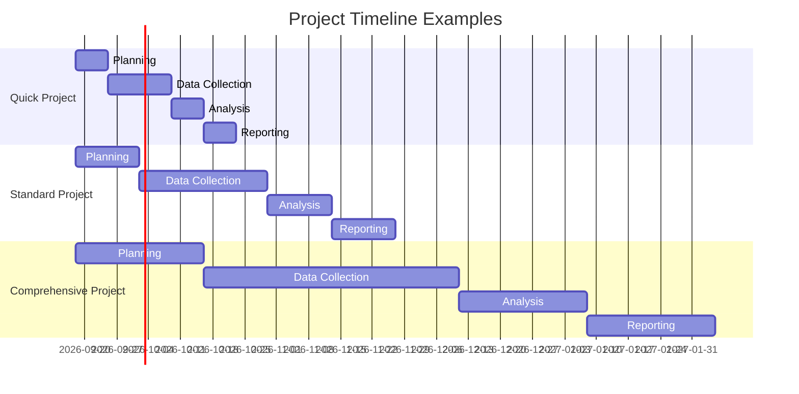

# Comprehensive Research Planning and Deliverables Guide

## Executive Summary  
This guide provides a structured approach to planning and conducting a research project. It outlines steps from defining objectives and search strategies to collecting and analyzing data, as well as reporting results. Key components include a research plan and methodology, a sample literature review format, data collection/analysis methods, project scope planning (with quick/standard/comprehensive timelines), risk and ethical considerations, citation best practices, and templates for presentations and reports. By following these guidelines with clear documentation, your research will be systematic, reproducible, and credible.

## Research Plan and Methodology  
A research plan starts with a clear scope, objectives, and specific research questions. The methodology should specify the research type (e.g. experimental, observational, qualitative) and detail the data collection and analysis methods. For example, one source advises that your methodology “explains what you did and how you did it,” so that readers can assess the reliability and validity of your work. It should also justify why the chosen methods suit your objectives. A typical plan includes: defining hypotheses or questions, identifying required data, choosing methods (surveys, experiments, interviews, etc.), and outlining how results will be evaluated. State the **search strategy** for background (key databases, keywords, timeframes) and prioritize primary and official sources (peer-reviewed journals, authoritative reports). Reference management tools (e.g. Zotero, Mendeley) can help organize and cite literature consistently.

## Sample Literature Review Template  
An effective literature review synthesizes existing studies to establish context and identify research gaps. Strong reviews are organized by themes/topics and integrate multiple sources with critical analysis. For example, annotated reviews across social science, education, nursing, humanities, and STEM fields illustrate how to compare findings and highlight gaps. A basic outline for a review might include:

- **Introduction:** Define the topic, its importance, and your specific research question.  
- **Thematic Sections:** Group findings by subtopic or theme. In each section, summarize the dominant conclusions of existing studies, note any contradictions or limitations, and explain how your research will address remaining questions.  
- **Gap/Transition:** Conclude by stating what is still unknown or unresolved, thus motivating your study.

Below is a sample template with example focus areas across disciplines:

| Discipline                    | Sample Focus                        | Example Synthesis/Source                                                       |
|-------------------------------|-------------------------------------|--------------------------------------------------------------------------------|
| Social Science (Economics)    | Gender and financial risk tolerance | Women report lower willingness to accept financial risk than men. |
| Education                     | Technology’s impact on learning     | Mixed findings: some studies show higher engagement with digital tools, others note distraction. |
| Nursing (Healthcare)          | Patient care interventions          | Research shows interactive education tools improve patient compliance.      |
| Humanities                    | Media narrative analysis            | Analyses reveal changing cultural narratives in news media over time.    |
| Engineering (STEM)            | Renewable energy adoption           | Adoption rates correlate with policy incentives and infrastructure support.    |

## Data Collection and Analysis Methods  
- **Quantitative Data Collection:** Use structured instruments to gather numerical data. Common methods include **surveys/questionnaires** (closed-ended questions to reach large samples), **experiments** (controlled manipulation of variables), and analysis of **existing records or datasets** (e.g. public statistics, organizational data). Structured **observations** with checklists or sensors can also yield quantitative data.  
- **Qualitative Data Collection:** Use open-ended or interactive methods to capture depth and context. Techniques include **interviews**, **focus groups**, **participant observation**, and **document analysis**. These allow participants to express perspectives in their own words and reveal insights that structured methods might miss. Always prepare clear protocols (e.g. interview guides) and pilot them if possible.  
- **Quantitative Analysis:** After data collection, process data using statistical software (R, Python, SPSS). Compute descriptive statistics (means, frequencies, charts) to summarize data, then use inferential tests (t-tests, ANOVA, regression) to examine relationships or test hypotheses. Visualizations (bar charts, scatterplots, etc.) help reveal patterns and outliers. Check assumptions (normality, etc.) and report confidence intervals or p-values as appropriate.  
- **Qualitative Analysis:** Code and interpret textual or multimedia data. Common steps are: transcribe data, read through it to identify recurring ideas, develop a coding scheme, apply codes to the data, and group codes into themes. Approaches like thematic analysis or content analysis provide structured techniques. For rigor, consider peer debriefing or inter-coder checks. Triangulate findings with multiple methods or data sources to enhance credibility.

## Deliverables and Timelines  
Define and schedule concrete outputs for your project. Typical deliverables include a **research proposal**, **data collection instruments**, **literature review report**, **raw dataset**, **analysis report**, and a **final written report or publication**. Set milestones (e.g. proposal completion, data collection end, draft report) to track progress. For example, one plan schedules the literature review by Month 2, data collection by Month 5, analysis by Month 6, and a final report by Month 9. The table below contrasts three example project scopes:

| Project Scope                    | Timeframe      | Approx. Effort  | Example Deliverables                                  |
|----------------------------------|----------------|-----------------|------------------------------------------------------|
| **Quick (Exploratory)**          | ~1–2 weeks     | ~40–80 hours    | Brief summary report or slide deck, initial findings  |
| **Standard (Moderate)**          | ~2–4 months    | ~150–250 hours  | Detailed report or whitepaper, figures/charts, slides |
| **Comprehensive (In-depth)**     | ~6–12 months   | ~300–500 hours  | Full thesis or article draft, datasets/code archive, presentations |

## Risks, Limitations, and Ethical Considerations  
Identify potential issues and address them upfront. **Limitations** (e.g. small sample sizes, short timelines, measurement constraints) should be acknowledged. For example, lab-based experiments may not fully represent real-world conditions, and qualitative studies with few participants may not generalize—such limitations should be noted. Discuss how you mitigate or justify them (e.g. citing robust analysis methods or focusing on depth over breadth). **Risks** can include delays (data collection setbacks, etc.), resource constraints, or biases. Include buffer time in schedules and alternative strategies (e.g. backup data sources).

For research involving people, follow ethical standards. Obtain institutional review board (IRB) approval if required. Ensure **informed consent** by fully informing participants of the study’s purpose, procedures, risks, and their rights (voluntary participation, right to withdraw). Emphasize confidentiality: remove or pseudonymize identifying data, securely store records, and limit access. Disclose any potential for harm and plan mitigation (e.g. counseling for sensitive topics). Respecting ethics protects participants and enhances research integrity.

## Citation and Documentation Practices  
Maintain clear and consistent citation to support transparency and reproducibility. Choose a standard reference style (APA, MLA, Chicago, etc.) and cite **all** sources of data, theory, or direct information. Use reference management tools (Zotero, Mendeley, EndNote) or citation generators to organize and format your bibliography. Always include complete details (author, year, title, source) and persistent identifiers (DOIs or stable URLs) where available. Keep thorough documentation of your research process: log search terms and database queries, save raw data files, and archive analysis scripts. Consider using version control (e.g. Git) for code. Where appropriate, share data and code in repositories (with proper anonymization and licensing) to allow others to verify and build on your work.

## Presenting Findings  
- **Slides:** Create a concise slide deck. Typical sections are: **Title**, **Outline/Agenda**, **Introduction** (research question and context), **Objectives/Hypotheses**, **Key Literature Highlights**, **Methods** (participants, procedures), **Results** (use charts/graphs to show main findings), **Discussion/Implications**, **Conclusion/Recommendations**, and **Q&A**. Use bullet points and visuals to focus attention. Highlight 2–3 main findings, using tables or figures. Keep text minimal on slides.  
- **Written Report Structure:** Follow a clear report format. Common sections include: **Abstract/Executive Summary**, **Introduction**, **Literature Review**, **Methodology**, **Results**, **Discussion**, **Conclusion**, and **References**. The **Abstract** (or Executive Summary) should succinctly state the purpose, methods, key results, and implications in ~1 paragraph. Each section should serve its purpose: introduction sets the stage, literature review surveys related work, methodology details the approach, results present the data, discussion interprets findings, and conclusion ties back to objectives. Use headings and subheadings for readability.  
- **Executive Summary (Example):** Provide a brief standalone synopsis. For example: *“This study investigated **[topic]** by conducting **[methods]** with **[sample]**. Key findings include: (1) **[Finding 1]**; (2) **[Finding 2]**; (3) **[Finding 3]** (e.g. **[statistic or insight]**). These results suggest **[implications]**, such as **[recommendation or conclusion]**. Overall, the study addresses **[research question]** and informs **[future work or policy]**.”* Use plain language and highlight only the most important results.

Each deliverable (slides, report, summary) should be logically organized and well-cited. By adhering to this plan and methodology, you ensure your research is thorough, transparent, and useful to stakeholders.

**Sources:** Guidelines for research planning and methodology.